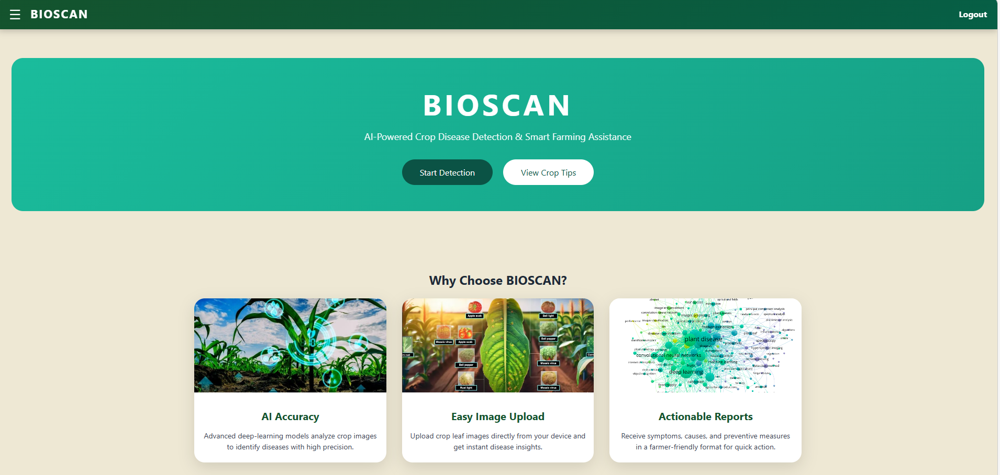
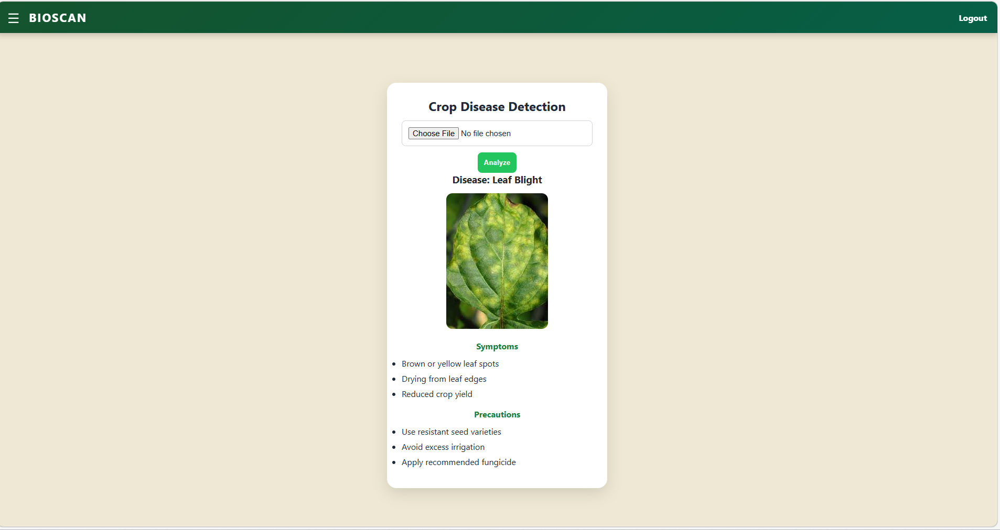

**Crop Disease Detection using Machine Learning**

An AI-powered web application that detects crop diseases from leaf images using computer vision and machine learning techniques.
The system helps in early disease identification to support precision agriculture and improve agricultural productivity.

**🚀Project Overview**

Crop diseases significantly reduce yield and farmer income. 
This project uses image preprocessing and a trained machine learning model to automatically classify plant leaf diseases.
The application allows users to upload a leaf image and instantly receive a prediction result.

**✨ Key Features**

    Leaf image upload via web interface
    Image preprocessing (resizing, normalization)
    Feature extraction and classification
    85%+ model accuracy
    Real-time prediction results
    Modular and scalable architecture

**Deployment-ready structure**

🛠️ **Tech Stack
👨‍💻 Programming**

    Python

**🤖Machine Learning**

     Scikit-learn
      NumPy
      OpenCV

**🌐Web Development**

     Flask
     HTML5
     CSS3

**☁️ Cloud (Optional Deployment)**

     AWS EC2
     IAM
     Security Groups

📂 **Project Structure
crops-disease-project/**

     │
     ├── app.py                # Flask application
     ├── train.py              # Model training script
     ├── test.py               # Model testing
     ├── model/                # Saved trained model
     ├── static/               # CSS & static files
     ├── templates/            # HTML templates
     ├── requirements.txt      # Dependencies
     └── users.json            # User data storage

     
📊 **Model Performance**

      Accuracy: 85%+
      Optimized using preprocessing and feature extraction
      Evaluated using classification metrics

**⚙️ Installation & Setup**

1️⃣ Clone the repository

git clone https://github.com/kethabhargavi/crops-disease-project.git

cd crops-disease-project

2️⃣ Install dependencies

pip install -r requirements.txt

3️⃣ Run the application

python app.py

**Open in browser:**

http://localhost:5000

**📸Sample Output**

**🔍 How It Works**

     User uploads a leaf image.
     Image is resized and normalized.
     Features are extracted.
     Trained ML model predicts disease class.
     Result is displayed to the user.

**💡 Future Improvements**

     Improve accuracy using CNN / Deep Learning
     Add real-time camera detection
     Deploy with Docker
     Build mobile application version
     Add multi-language support for farmers

**👩‍💻 Author**

Bhargavi Ketha

Computer Science Engineering Student

GitHub: https://github.com/kethabhargavi/

LinkedIn:[https://leetcode.com/u/KethaBhargavi2004/]
